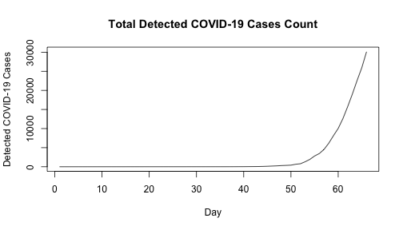

# STAT 153: Project Blog
### Group: Kathy Tong (ID: 3031797536)
### Date: May 6th, 2020

## Introduction

With the explosion of COVID-19 internationally in the past few months, we'd like to look at some of the previous data for total COVID-19 infections per day and use that to forecast into the future how many people we predict to be infected with COVID-19 in the next 10 days.

## The Model

Looking at the data, the number of infected each day seems to grow exponentially. This means that not only are the number of infections growing each day, but the very rate at which the infections grow is also growing. 

After removing the exponential growth rate by taking the logarithm of our data, we can use a statistical model called ARIMA to further fit the data. Using this ARIMA model, we can predict the infection numbers for the days we were provided in the actual data, and then look at how close our predictions are to the actual data to check how good our model is. 

## Predictions

## Limitations

